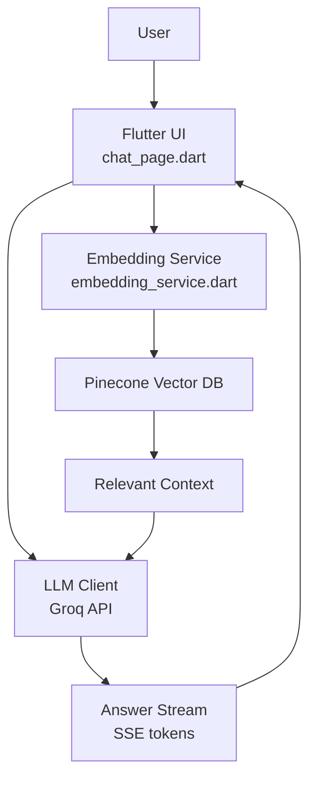

## Hydraulic Assistant – Flutter + AI (RAG)

[](#)
[](#)
[](#license)

### Overview
Hydraulic Assistant is a Flutter application that provides an AI expert for hydraulic hose pressure and systems. Users can ask questions and receive safety-focused, context-aware answers sourced from a domain knowledge base.

This is an ongoing project. Future work includes AI-driven automatic UI changes so users can access orders or browse items purely through AI guidance without manually searching.

### Screenshots

<p><em>Chat UI with streaming response</em></p>


<p><em>Connectivity diagnostics and network tests</em></p>


<p><em>RAG-based answer with context</em></p>


---

### Quick Start

Prerequisites: Flutter 3.x, Dart SDK, Android/iOS tooling set up.

```bash
cd flutter_application_2
flutter pub get
flutter run
```

---

### Build

```bash
# Android
flutter build apk

# iOS (from macOS with Xcode)
flutter build ios

# Web
flutter build web
```

---

### Firebase Integration

This app initializes Firebase at startup using FlutterFire.

- Initialization: `flutter_application_2/lib/main.dart`
  - Uses `DefaultFirebaseOptions.currentPlatform` from `firebase_options.dart`
- Options file: `flutter_application_2/lib/firebase_options.dart` (auto‑generated)
- Android config: `flutter_application_2/android/app/google-services.json`
- iOS/macOS: configured via `Runner` project files under `flutter_application_2/ios/`

Reconfigure or set up a new Firebase project:

```bash
dart pub global activate flutterfire_cli
flutterfire configure
```

If you change Firebase projects, re‑run the commands above to regenerate `firebase_options.dart` and platform files.

### What’s Implemented in the AI Layer
- **Retrieval-Augmented Generation (RAG)**:
  - Embeds user queries and retrieves relevant context from a vector database before asking the LLM.
  - Files: `lib/pinecone_grok_service.dart`, `lib/embedding_service.dart`.

- **Vector Store: Pinecone**:
  - Upsert/query endpoints used via REST (`upsertToPinecone`, `queryPinecone`).
  - Configured through `EnvConfig` (API key, base URL, index).

- **Embeddings**:
  - `EmbeddingService` provides a lightweight, deterministic fallback embedding (`generateSimpleEmbedding`) and an async wrapper (`generateApiEmbedding`).
  - Easily swappable for external APIs (OpenAI/Cohere, etc.).

- **LLM: Groq (OpenAI-compatible API)**:
  - Generates final answers conditioned on retrieved context (`askGroq`).
  - Supports token streaming over SSE for a responsive UI (`askGroqStream`).

- **End-to-end Answering**:
  - `answerUserQuery` and `answerUserQueryStream` implement the full pipeline: embed → retrieve context → call LLM → stream tokens.

### Primary Use Case
- **Hydraulic knowledge assistant** for:
  - Pressure ratings, safety factors, and standards
  - Hose selection and sizing
  - Calculations and troubleshooting
  - Best practices and safety guidance

### Why It’s Useful
- **Speed and accuracy**: Context retrieval improves answer relevance.
- **Safety-first guidance**: System prompt is tuned for hydraulic safety.
- **Great UX**: Streaming “typewriter” responses reduce perceived latency.
- **Persistence**: Chat history is stored locally for continuity.

---

### Architecture



Flow: the app embeds the query, retrieves context from Pinecone, then calls Groq to generate a context‑aware response streamed back to the UI.

### Flutter App Details (brief)
- Screen: `lib/chat_page.dart`
  - Stateful chat UI with message bubbles for user and AI.
  - **Streaming UI**: typewriter effect, blinking cursor, smooth autoscroll.
  - **Local storage**: chat history via `SharedPreferences`.
  - **Connectivity checks**: user-friendly errors and basic network tests.

### Roadmap (in progress)
- [ ] AI-driven automatic UI navigation
- [ ] Production-grade embedding provider (OpenAI/Cohere/local)
- [ ] Richer knowledge base ingestion and metadata for retrieval

---

### Troubleshooting
- **No internet / timeouts**: Verify connectivity. Try `flutter_application_2/lib/network_test.dart` utilities.
- **Pinecone 401/404**: Check `PINECONE_API_KEY` and `PINECONE_BASE_URL` in `.env`.
- **Groq API errors**: Verify `GROQ_API_KEY` is valid; confirm base URL.
- **Firebase init**: Ensure `firebase_options.dart` matches your project and platforms.

---

### Contributing
PRs are welcome. Please open an issue first to discuss major changes.

---

### License
TBD

---

### About
This app is built for Sabari Hydro Pneumatics (est. 2010), specializing in hydraulics and pneumatics solutions with a focus on reliability, safety, and efficiency.

### Configuration (high level)
Create and load environment variables used by the app.

1) Create a `.env` file in `flutter_application_2/` (same level as `pubspec.yaml`):

```
PINECONE_API_KEY=your_pinecone_key
PINECONE_BASE_URL=https://your-index-your-project.svc.pinecone.io
GROQ_API_KEY=your_groq_key
GROQ_BASE_URL=https://api.groq.com/openai/v1
```

2) Ensure `EnvConfig` loads variables at app startup:
- File: `flutter_application_2/lib/config/env_config.dart`
- The app should call `EnvConfig.load()` before using keys.

3) Firebase configuration is generated by FlutterFire:
- File: `flutter_application_2/lib/firebase_options.dart`
- Android `google-services.json` is in `flutter_application_2/android/app/`.

### File Map (relevant)
- `flutter_application_2/lib/chat_page.dart`: Flutter chat UI, streaming UX, persistence
- `flutter_application_2/lib/pinecone_grok_service.dart`: RAG pipeline, Pinecone + Groq integration
- `flutter_application_2/lib/embedding_service.dart`: Embedding generation abstraction
- `flutter_application_2/lib/network_test.dart`: Connectivity diagnostics (internet/Pinecone/Groq)

### Status
Ongoing development. See “Future Roadmap” for upcoming features.