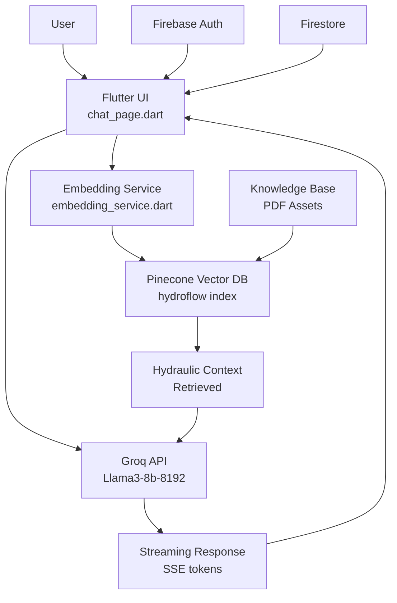

## Hydraulic Assistant – Flutter + AI (RAG)

[](#)
[](#)
[](#)
[](#license)

### Overview
Hydraulic Assistant is a comprehensive Flutter application that provides an AI-powered expert system for hydraulic hose pressure and systems. Built for **Sabari Hydro Pneumatics**, this app combines modern mobile development with advanced AI capabilities to deliver safety-focused, context-aware answers sourced from a specialized hydraulic engineering knowledge base.

**Key Features:**
- 🤖 **AI-Powered Chat Assistant** with streaming responses
- 🔐 **Complete Authentication System** (Email/Password + Google Sign-In)
- 📊 **RAG (Retrieval-Augmented Generation)** for accurate technical answers
- 🏠 **Professional Dashboard** with company branding
- 📱 **Cross-Platform Support** (Android, iOS, Web)
- 🔄 **Real-time Streaming** chat with typewriter effects
- 💾 **Persistent Chat History** and user sessions

This is an ongoing project with future plans for AI-driven automatic UI navigation and enhanced product catalog integration.

### Screenshots

<table>
  <tr>
    <td align="center">
      <br/>
      <sub>Chat UI with streaming response</sub>
    </td>
    <td align="center">
      <br/>
      <sub>Connectivity diagnostics and network tests</sub>
    </td>
    <td align="center">
      <br/>
      <sub>RAG-based answer with context</sub>
    </td>
  </tr>
  </table>

---

### Quick Start

**Prerequisites:**
- Flutter 3.7.2 or higher
- Dart SDK
- Android Studio / Xcode for mobile development
- Firebase project setup
- API keys for Pinecone and Groq

**Installation:**

1. **Clone and setup dependencies:**
   ```bash
   cd flutter_application_2
   flutter pub get
   ```

2. **Configure environment variables:**
   ```bash
   cp .env.example .env
   # Edit .env with your actual API keys
   ```

3. **Firebase setup:**
   ```bash
   # Install FlutterFire CLI if not already installed
   dart pub global activate flutterfire_cli
   
   # Configure Firebase (optional - already configured)
   flutterfire configure
   ```

4. **Run the application:**
   ```bash
   flutter run
   ```

For detailed environment setup, see [ENV_SETUP.md](flutter_application_2/ENV_SETUP.md).

---

### Build

```bash
# Android
flutter build apk

# iOS (from macOS with Xcode)
flutter build ios

# Web
flutter build web
```

---

### Testing

```bash
cd flutter_application_2
flutter test
```

Key tests live under `flutter_application_2/test/` (for example, `widget_test.dart`).

---

### Firebase Integration

This app initializes Firebase at startup using FlutterFire.

- Initialization: `flutter_application_2/lib/main.dart`
  - Uses `DefaultFirebaseOptions.currentPlatform` from `firebase_options.dart`
- Options file: `flutter_application_2/lib/firebase_options.dart` (auto‑generated)
- Android config: `flutter_application_2/android/app/google-services.json`
- iOS/macOS: configured via `Runner` project files under `flutter_application_2/ios/`

Reconfigure or set up a new Firebase project:

```bash
dart pub global activate flutterfire_cli
flutterfire configure
```

If you change Firebase projects, re‑run the commands above to regenerate `firebase_options.dart` and platform files.

Services used (from `pubspec.yaml`):
- `firebase_core` (init)
- `firebase_auth` (auth)
- `cloud_firestore` (database)
- `google_sign_in` (provider auth)

---

### Application Features

**🔐 Authentication System:**
- **Email/Password Login**: Firebase Auth integration with form validation
- **Google Sign-In**: One-tap authentication with Google accounts
- **User Management**: Persistent sessions with Firestore user data
- **Security**: Secure token management and session handling

**🏠 Home Dashboard:**
- **User Greeting**: Personalized welcome with Firebase user data
- **Company Showcase**: Image carousel featuring Sabari Hydro Pneumatics facilities
- **Quick Access**: Navigation to chat assistant and product catalog
- **System Status**: Real-time operational indicators and efficiency metrics

**💬 AI Chat Interface:**
- **Streaming Responses**: Real-time typewriter effect with blinking cursor
- **Chat History**: Persistent conversation storage using SharedPreferences
- **Network Resilience**: Connectivity checks and graceful error handling
- **Professional UI**: Message bubbles with company branding

**📱 Cross-Platform Support:**
- **Android**: Native Android app with Material Design
- **iOS**: Native iOS app with Cupertino design elements
- **Web**: Progressive Web App (PWA) capabilities

---

### What’s Implemented in the AI Layer
- **Retrieval-Augmented Generation (RAG)**:
  - Embeds user queries and retrieves relevant context from a vector database before asking the LLM.
  - Files: `flutter_application_2/lib/pinecone_grok_service.dart`, `flutter_application_2/lib/embedding_service.dart`.

- **Vector Store: Pinecone**:
  - Upsert/query endpoints used via REST (`upsertToPinecone`, `queryPinecone`).
  - Configured through `EnvConfig` (API key, base URL, index).

- **Embeddings**:
  - `EmbeddingService` provides a lightweight, deterministic fallback embedding (`generateSimpleEmbedding`) and an async wrapper (`generateApiEmbedding`).
  - Easily swappable for external APIs (OpenAI/Cohere, etc.).

- **LLM: Groq (OpenAI-compatible API)**:
  - Generates final answers conditioned on retrieved context (`askGroq`).
  - Supports token streaming over SSE for a responsive UI (`askGroqStream`).

- **End-to-end Answering**:
  - `answerUserQuery` and `answerUserQueryStream` implement the full pipeline: embed → retrieve context → call LLM → stream tokens.

### Primary Use Case
- **Hydraulic knowledge assistant** for:
  - Pressure ratings, safety factors, and standards
  - Hose selection and sizing
  - Calculations and troubleshooting
  - Best practices and safety guidance

### Why It’s Useful
- **Speed and accuracy**: Context retrieval improves answer relevance.
- **Safety-first guidance**: System prompt is tuned for hydraulic safety.
- **Great UX**: Streaming “typewriter” responses reduce perceived latency.
- **Persistence**: Chat history is stored locally for continuity.

---

### Architecture



**Flow:** User authenticates → asks hydraulic question → app embeds query → searches Pinecone for relevant context → Groq generates safety-focused response → streams back to UI with typewriter effect.

**Key Components:**
- **Frontend**: Flutter with Material Design and custom glassmorphic UI
- **Authentication**: Firebase Auth with Google Sign-In
- **Database**: Firestore for user data, SharedPreferences for chat history
- **AI Pipeline**: Pinecone (vector DB) + Groq (LLM) + custom embedding service
- **Knowledge Base**: Hydraulic engineering PDFs and specifications

### Flutter App Structure

**📱 Main Screens:**
- **Login Page** (`login_page.dart`): Glassmorphic design with Firebase Auth
- **Home Dashboard** (`home.dart`): Company showcase with navigation
- **Chat Interface** (`chat_page.dart`): AI assistant with streaming responses
- **Products Page** (`products.dart`): Hydraulic components catalog

**🔧 Core Services:**
- **PineconeGrokService** (`pinecone_grok_service.dart`): RAG pipeline implementation
- **EmbeddingService** (`embedding_service.dart`): Text embedding generation
- **EnvConfig** (`config/env_config.dart`): Environment variable management
- **NetworkTest** (`network_test.dart`): Connectivity diagnostics

**✨ UI Features:**
- **Streaming Chat**: Real-time typewriter effect with blinking cursor
- **Glassmorphic Design**: Modern UI with backdrop filters and shadows
- **Responsive Layout**: Adaptive design for different screen sizes
- **Error Handling**: User-friendly error messages and network checks
- **Persistent Storage**: Chat history and user preferences

### Roadmap & Future Enhancements

**🚀 Immediate Improvements:**
- [ ] **Enhanced Embeddings**: Integrate OpenAI/Cohere for better semantic understanding
- [ ] **Knowledge Base Processing**: Automated PDF ingestion pipeline to Pinecone
- [ ] **Code Quality**: Update deprecated `withOpacity` calls to `withValues()`
- [ ] **Production Logging**: Replace print statements with proper logging framework

**🎯 Feature Roadmap:**
- [ ] **AI-Driven Navigation**: Automatic UI changes based on user intent
- [ ] **Product Integration**: AI-guided product browsing and ordering
- [ ] **Voice Interface**: Speech-to-text for hands-free operation
- [ ] **Offline Mode**: Local knowledge base for basic queries
- [ ] **Multi-language Support**: Localization for different markets
- [ ] **Advanced Analytics**: User interaction tracking and insights

**🔧 Technical Enhancements:**
- [ ] **Performance Optimization**: Lazy loading and caching strategies
- [ ] **Testing Suite**: Comprehensive unit and integration tests
- [ ] **CI/CD Pipeline**: Automated testing and deployment
- [ ] **Security Audit**: Enhanced security measures and compliance

---

### Troubleshooting
- **No internet / timeouts**: Verify connectivity. Try `flutter_application_2/lib/network_test.dart` utilities.
- **Pinecone 401/404**: Check `PINECONE_API_KEY` and `PINECONE_BASE_URL` in `.env`.
- **Groq API errors**: Verify `GROQ_API_KEY` is valid; confirm base URL.
- **Firebase init**: Ensure `firebase_options.dart` matches your project and platforms.

---

### Security
- Do not commit secrets. Keep `.env` files out of version control (already ignored in `flutter_application_2/.gitignore`).
- Prefer environment variables or secret managers in CI/CD.
- Rotate keys if exposed and reconfigure immediately.

---

### Contributing
PRs are welcome. Please open an issue first to discuss major changes.

---

### License
TBD

---

### About
This app is built for Sabari Hydro Pneumatics (est. 2010), specializing in hydraulics and pneumatics solutions with a focus on reliability, safety, and efficiency.

### Configuration (high level)
Create and load environment variables used by the app.

1) Create a `.env` file in `flutter_application_2/` (same level as `pubspec.yaml`):

```
PINECONE_API_KEY=your_pinecone_key
PINECONE_BASE_URL=https://your-index-your-project.svc.pinecone.io
GROQ_API_KEY=your_groq_key
GROQ_BASE_URL=https://api.groq.com/openai/v1
```

2) Ensure `EnvConfig` loads variables at app startup:
- File: `flutter_application_2/lib/config/env_config.dart`
- The app should call `EnvConfig.load()` before using keys.

3) Firebase configuration is generated by FlutterFire:
- File: `flutter_application_2/lib/firebase_options.dart`
- Android `google-services.json` is in `flutter_application_2/android/app/`.

### Knowledge Base Assets

The application includes specialized hydraulic engineering documentation:

**📄 Technical Documents:**
- `assets/data.pdf` & `assets/data.docx` - Main hydraulic knowledge base
- `assets/ph153-r1at-1-sn-hose.pdf` - R1AT single wire braid hose specifications
- `assets/ph154-r2at-2sn-hose.pdf` - R2AT double wire braid hose specifications  
- `assets/ph277-4sp.pdf` - 4SP four spiral wire hose specifications
- `assets/ph278-4sh.pdf` - 4SH four spiral wire hose specifications

**🔧 Content Coverage:**
- Hydraulic hose pressure ratings and safety factors
- SAE and DIN standard specifications
- Temperature ranges and fluid compatibility
- Installation guidelines and best practices
- Troubleshooting and maintenance procedures

### File Map (Key Components)
- `flutter_application_2/lib/main.dart`: Application entry point with Firebase initialization
- `flutter_application_2/lib/login_page.dart`: Authentication UI with glassmorphic design
- `flutter_application_2/lib/home.dart`: Dashboard with company branding and navigation
- `flutter_application_2/lib/chat_page.dart`: AI chat interface with streaming responses
- `flutter_application_2/lib/pinecone_grok_service.dart`: RAG pipeline implementation
- `flutter_application_2/lib/embedding_service.dart`: Text embedding generation service
- `flutter_application_2/lib/config/env_config.dart`: Environment configuration management
- `flutter_application_2/lib/network_test.dart`: Connectivity diagnostics utilities

### Status
Ongoing development. See “Future Roadmap” for upcoming features.
---

##
 Project Highlights

### 🎯 What Makes This Special

**Advanced AI Integration:**
- Production-ready RAG (Retrieval-Augmented Generation) implementation
- Real-time streaming responses with professional UI effects
- Context-aware hydraulic engineering expertise
- Fallback embedding system for reliability

**Enterprise-Grade Architecture:**
- Firebase integration for authentication and data management
- Modular service architecture with clean separation of concerns
- Environment-based configuration for secure API key management
- Cross-platform compatibility with responsive design

**Professional User Experience:**
- Glassmorphic UI design with company branding
- Smooth animations and transitions
- Persistent chat history and user sessions
- Comprehensive error handling and network resilience

**Domain Expertise:**
- Specialized hydraulic engineering knowledge base
- Safety-focused AI responses for critical applications
- Technical documentation integration (pressure ratings, specifications)
- Industry-standard compliance and best practices

### 🏆 Technical Achievements

- **Real-time AI Streaming**: Implemented SSE-based token streaming for responsive chat
- **RAG Pipeline**: Built complete retrieval-augmented generation system from scratch
- **Cross-Platform**: Single codebase supporting Android, iOS, and Web
- **Production Ready**: Comprehensive error handling, logging, and configuration management
- **Scalable Architecture**: Modular design ready for feature expansion

This project demonstrates modern mobile development practices combined with cutting-edge AI technology, specifically tailored for the hydraulic engineering domain.